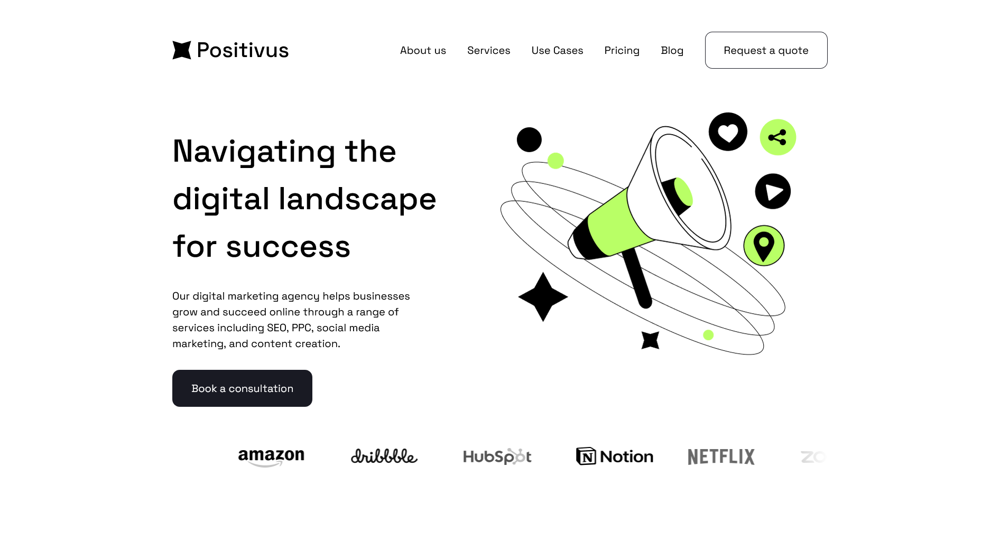

# positivus


---
👉 [Посмотреть онлайн (GitHub Pages)](https://zheny179.github.io/positivus/)

## 📸 Скриншот




## 🛠️ Используемые инструменты и технологии

### Основные технологии:
- **HTML5**
- **SCSS (Sass)**
- **JavaScript**

### Сборка и инструменты:
- **Vite**
- **npm**

### Разработка и дизайн:
- **WebStorm**
- **Figma**

### Оптимизация и качество:
- **Normalize.css**
- **БЭМ методология**

### Тестирование:
- **W3C Validator**

### Библиотеки:
- **swiper**
---

## 🚀 Как запустить локально
1.  Склонируй репозиторий: <br/>
    ```bash
    git clone https://github.com/Zheny179/positivus.git
    ```
2.  Перейдите в папку проекта
    ```bash
    cd positivus
    ```
3.  Установите зависимости  <br/>
    ```bash
    npm i
    ```
4.  Запустите проект в режиме разработки: <br/>
    ```bash
    npm run dev
    ```
5.  Для сборки проекта: <br/>
    ```bash
    npm run build
    ```
6.  Для просмотра собранного проекта
    ```bash
    npm run preview
    ```

## 🎨 Структура проекта

```
positivus/
├── public/               # Статические файлы
│   └── ...
├── src/                  # Исходный код приложения
│   ├── assets/           # Обрабатываются
│   │   |── fonts         # Шрифты
│   │   |── icons         # svg 
│   │   └──  images       # Картинки
│   ├── styles/           # Общие стили (переменные, утелитарные классы, mixin)
│   └── modules/          # JS модули
├── .gitignore            # Файлы и папки, игнорируемые Git
├── package.json          # Манифест проекта (зависимости, скрипты)
├── package-lock.json     # Точная версия зависимостей
├── README.md             # Документация проекта
├── index.html            # Главная страница (точка входа)
├── jsconfig.json         # Настройка алиасов для IDE
└── vite.config.js        # Настройки vite
```

## 📜Ссылочки
1. [Normalize](https://necolas.github.io/normalize.css/)
2. [Макет сайта](https://www.figma.com/design/racHPrMNd7jO0XgXQPpE7w/Positivus-Landing-Page-Design--Community-?m=auto&t=JkZZ5aZYWnuSdA5g-6)
3. [Vite](https://vite.dev/)
4. [Swiper](https://swiperjs.com/)